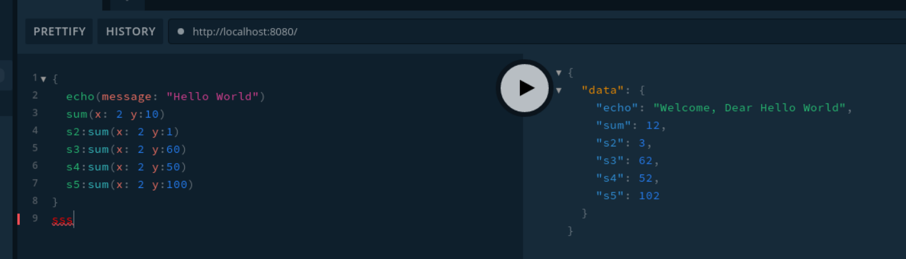

# First PHP GraphQL (Web-service)

GraphQL is a new generation of web services, it's best to maintain a big webservice for multi-platform and projects; In this repository, we design a full-feature **graphql server** using **PHP**.

## GraphQL Shema

```graphql
type Query {
  echo(message: String!): String!
  sum(x: Int!, y: Int!): Int!
}
```

## Using

Install **composer** and installing required packages:

```
sudo apt install composer
composer install
```

```
php -S localhost:8080 ./graphql.php
```

Open `http://localhost:8080/` at your browser and use.

## Example

#### Input

```graphql
{
  echo(message: "Hello World")
  sum(x: 2 y:10)
  s2:sum(x: 2 y:1)
  s3:sum(x: 2 y:60)
  s4:sum(x: 2 y:50)
  s5:sum(x: 2 y:100)
}
```

#### Output

```json
{
  "data": {
    "echo": "Welcome, Dear Hello World",
    "sum": 12,
    "s2": 3,
    "s3": 62,
    "s4": 52,
    "s5": 102
  }
}
```

## GraphQL Playground

Installing at arch: `yay graphql-playground-electron`



© Copyright Max Base, 2021
